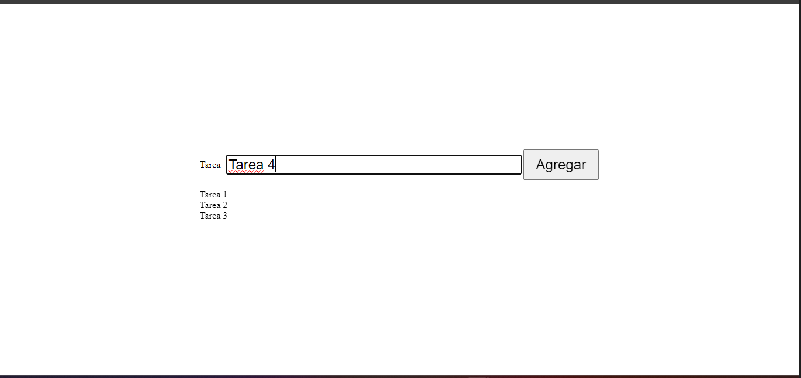

# Simple To Do List

Una aplicación web simple y funcional para gestionar tareas pendientes (To Do List) desarrollada con HTML, CSS y JavaScript vanilla.

## Descripción

Este proyecto es una lista de tareas básica que permite a los usuarios agregar nuevas tareas de forma intuitiva. La aplicación cuenta con una interfaz limpia y moderna utilizando Bootstrap para el estilo, centrada en la usabilidad y simplicidad.

## Características

- ✅ Agregar nuevas tareas escribiendo en el campo de texto
- ✅ Agregar tareas presionando el botón "Agregar" o la tecla Enter
- ✅ Interfaz responsive y moderna con Bootstrap
- ✅ Diseño centrado y limpio
- ✅ Validación básica (no permite agregar tareas vacías)

## Tecnologías utilizadas

- **HTML5**: Estructura de la aplicación
- **CSS3**: Estilos personalizados y diseño responsive
- **JavaScript**: Funcionalidad de la aplicación
- **Bootstrap 5.3.3**: Framework CSS para componentes y estilos
- **Popper.js**: Biblioteca para tooltips y popovers de Bootstrap

## Estructura del proyecto

```
simpleToDoList/
├── index.html          # Página principal de la aplicación
├── index.js            # Lógica de JavaScript para la funcionalidad
├── style.css           # Estilos CSS personalizados
└── screenshot_1.png    # Captura de pantalla de la aplicación
```

## Instalación y uso

### Prerrequisitos
- Un navegador web moderno (Chrome, Firefox, Safari, Edge)
- No requiere servidor web (puede ejecutarse localmente)

### Instrucciones

1. **Clona o descarga el repositorio**:
   ```bash
   git clone https://github.com/crigca/simpleToDoList.git
   ```

2. **Navega al directorio del proyecto**:
   ```bash
   cd simpleToDoList
   ```

3. **Abre el archivo `index.html` en tu navegador**:
   - Doble clic en el archivo `index.html`, o
   - Abre tu navegador y arrastra el archivo `index.html` a la ventana del navegador, o
   - Usa la opción "Abrir archivo" en tu navegador

4. **¡Listo! Ya puedes usar la aplicación**:
   - Escribe una tarea en el campo de texto
   - Presiona el botón "Agregar" o la tecla Enter
   - La tarea aparecerá en la lista debajo

## Funcionalidades técnicas

### JavaScript (index.js)
- **Selección de elementos DOM**: Obtiene referencias a los elementos principales
- **Función `addTask()`**: Valida y agrega nuevas tareas a la lista
- **Event listeners**: Maneja clics en el botón y pulsaciones de tecla Enter
- **Validación de entrada**: Previene agregar tareas vacías usando `trim()`

### CSS (style.css)
- **CSS Grid**: Utiliza Grid Layout para centrar el contenido
- **Diseño responsive**: El contenedor ocupa el 50% del ancho de la pantalla
- **Estilos personalizados**: Mejora la apariencia de formularios y listas

### HTML (index.html)
- **Bootstrap integration**: Incluye Bootstrap 5.3.3 via CDN
- **Estructura semántica**: Utiliza elementos HTML apropiados
- **Formulario accesible**: Incluye labels y atributos de accesibilidad

## Captura de pantalla



## Posibles mejoras futuras

- [ ] Persistencia de datos (LocalStorage)
- [ ] Eliminar tareas individuales
- [ ] Marcar tareas como completadas
- [ ] Editar tareas existentes
- [ ] Filtros por estado (completadas/pendientes)
- [ ] Drag and drop para reordenar tareas
- [ ] Modo oscuro

## Contribuciones

Las contribuciones son bienvenidas. Si deseas mejorar este proyecto:

1. Haz un fork del repositorio
2. Crea una rama para tu feature (`git checkout -b feature/nueva-funcionalidad`)
3. Commit tus cambios (`git commit -am 'Agregar nueva funcionalidad'`)
4. Push a la rama (`git push origin feature/nueva-funcionalidad`)
5. Abre un Pull Request

## Licencia

Este proyecto es de código abierto y está disponible bajo la licencia MIT.

## Autor

- **crigca** - [GitHub](https://github.com/crigca)

---

**Nota**: Este es un proyecto educativo/de demostración que muestra conceptos básicos de desarrollo web front-end.
